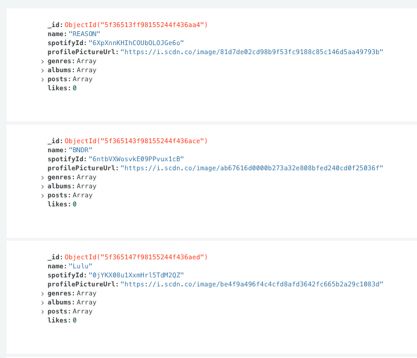
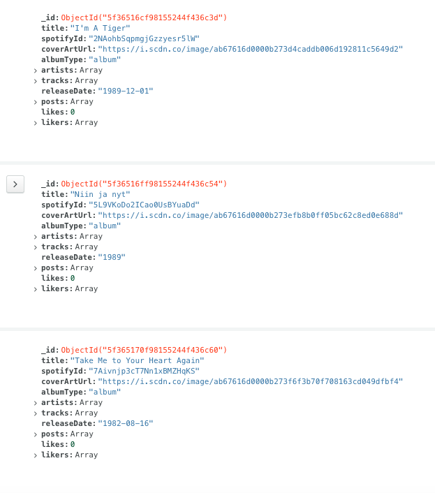
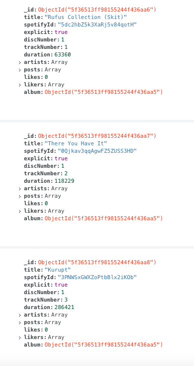

# Music Scraper
Music Scraper is a Python application that can grab top artists' data (albums, tracks, profile pictures, etc.) and, if needed, store that data in MongoDB database.

## Table of Contents
* [Introduction](#introduction)
* [Technologies](#technologies)
* [Setup](#setup)
* [Usage](#usage)
* [Contact Me](#contact-me)

## Introduction
Music Scraper is a Python application that can...
1. Web scrape [Billboard's Top 100 Artists chart](https://www.billboard.com/charts/artist-100 "Billboard Artist 100 Chart") for artist names.
2. Get artists' data, albums, and tracks using [Spotify's Web API](https://developer.spotify.com/documentation/web-api/ "Spotify's Web API")
3. Store the "Artists", "Albums", and "Tracks" as documents inside a MongoDB database.
4. Link the "Artists", "Albums", and "Tracks" together, creating a graph of related documents.

I built Music Scraper to use for a personal project called **FanSpot**, a music forum site built for discussion around artists' discographies.

(Note: If you are interested in following the progress on **FanSpot**, see the [Trello board](https://trello.com/b/F906TQB7 "FanSpot Website").)

## Technologies
This project is created with:
* [Python v3.8.3](https://docs.python.org/release/3.8.3/)
* [Requests v2.22.0](https://requests.readthedocs.io/en/master/)
* [BeautifulSoup v4.9.1](https://www.crummy.com/software/BeautifulSoup/bs4/doc/)
* [MongoEngine v0.20.0](http://docs.mongoengine.org/)
* [Spotipy v2.13.0](https://spotipy.readthedocs.io/en/2.13.0/)

## Setup
### For MacOS
1. Clone the repository:
```
# Clone the repo.
git clone git@github.com:justinyum98/music-scraper.git

# Move into the project directory.
cd music-scraper
```
2. Set up a virtual environment:
```
# Create virtual environment.
python3 -m venv .venv

# Activate the virtual environment.
source .venv/bin/activate
```
3. Run the `setup.py` file:
```
# Install all required packages into virtual environment.
python3 -m pip install .
```

### For Windows
1. Clone the repository:
```
# Clone the repo.
git clone git@github.com:justinyum98/music-scraper.git

# Move into the project directory.
cd music-scraper
```
2. Set up a virtual environment:
```
# Create virtual environment.
py -m venv .venv

# Activate the virtual environment.
.\.venv\Scripts\activate
```
3. Run the `setup.py` file:
```
# Install all required packages into virtual environment.
pip install -e .
```

## Usage
Before starting, you need to:
- Create a Spotify "Application" in [Spotify's Developer Dashboard](https://developer.spotify.com/dashboard/).
  - Why: You need a client id and client secret to access Spotify's API.
- Store the application's client id and client secret as environment variables.
  - `SPOTIPY_CLIENT_ID` and `SPOTIFY_CLIENT_SECRET`
- *(Optional) If you want to store the music data within a MongoDB database, you need the URI for your database. Then, store the uri as an environment variable.*
  - `MONGODB_URI`

### Scripts
There are five scripts that you must run in a specific order.
1. [`run_1_billboard_scraper.py`](samples/run_1_billboard_scraper.py)
   - Uses `BeautifulSoup` to parse for artist names inside the HTML of Billboard's Top 100 Artists webpage.
   - Stores the artist names inside a set, ensuring that no duplicates are added.
2. [`run_2_get_all_artists.py`](samples/run_2_get_all_artists.py)
   - With the set of unique artist names, this script queries for the artists' Spotify IDs using [Spotify's Search API](https://developer.spotify.com/documentation/web-api/reference-beta/#endpoint-search).
   - Then, those IDs are passed into an recursive algorithm that, given an artist's Spotify ID, grabs all "relevant" artists. "Relevant" meaning artists:
     - featured on tracks
     - co-artists on albums
     - "related" to the artist, as [recommended by Spotify](https://developer.spotify.com/documentation/web-api/reference-beta/#endpoint-get-an-artists-related-artists).
   - (Note: As the algorithm is recursive, to prevent `RecursionError`, you can set a depth limit. The time needed to run the script varies by the set depth limit.)
   - Using that recursive algorithm, new artists and their Spotify IDs are added into a dictionary.
   - Finally, once complete, the result dictionary is stored as `spotify_artists.jsonc` inside `samples/responses`.
3. [`run_3_get_albums_and_tracks.py`](samples/run_3_get_albums_and_tracks.py)
   - Using the dictionary of artists and their Spotify IDs from `spotify_artists.jsonc`, this script will each artist's:
     - data (profile picture url, genres, etc.)
     - albums
     - each album's tracks
   - It then stores the result as `spotify_artists_data.jsonc` inside `samples/responses`.
4. [`run_4_store_data_in_db.py`](samples/run_4_store_data_in_db.py)
   -  **NOTE**: *Before running, you need to set `MONGODB_URI` to the uri of your MongoDB database.*
   -  This script retrieves the artists' data stored in `spotify_artists_data.jsonc` and creates collections called:
      -  `Artists`
      -  `Albums`
      -  `Tracks`
   - Here are some examples (screenshotted from my MongoDB Atlas database):
     - Artists:
       - 
     - Albums:
       - 
     - Tracks:
       - 
5. [`run_5_link_artists_albums_songs.py`](samples/run_5_link_artists_albums_songs.py)
   - In previous script, though the `Artists`, `Albums`, and `Tracks` were created, they have not been "linked".
     - For example, an `Artist` has a list reference field called `albums` that contains the IDs of the artist's `Albums`.
     - Similarly, an `Album` has a list reference field called `artists` that contains the IDs of the album's `Artists`. It also has a list reference field called `tracks` that contains the IDs of the album's `Tracks`.
     - Finally, a `Track` has a list field called `artists` that contains the IDs of the track's `Artists`. It also has a reference field called `album` that contains the ID of the track's `Album`.
   - This script links everything together by using `spotify_artists_data.jsonc` as a reference.

## Contact Me
If you have any questions, need help, or just want to chat, feel free to shoot me an email at `justinyum98@gmail.com`.
